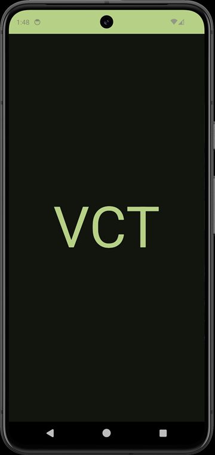
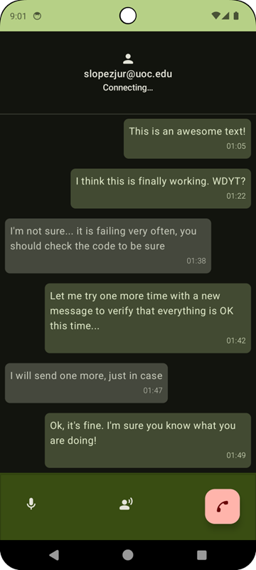

# Voice Call Translator

Always wanted to talk to your uncle who lives at the South Pole but neither of you learned the
other's language? Don't worry, with **Voice Call Translator** the problem is solved, or partially
solved.

## What is Voice Call Translator or VCT?

VCT is a P2P calling application with instant call translation. It is based on:

- Firebase for Signaling and live chat messages
  - Firebase [Auth](https://firebase.google.com/docs/auth) for SignUp and authentication
  - [Realtime Database](https://firebase.google.com/docs/database) for User interactions
- [WebRTC](https://webrtc.org/) for establishing P2P communication (provided by GetStream library)
- STUN and TURN servers to facilitate communication through NAT (requires specific credentials)
- Three different [models](https://platform.openai.com/docs/models/model-endpoint-compatibility)
  from OpenAI to apply the magic:
  - Whisper for the transcriptions ([whisper-1](https://platform.openai.com/docs/models/whisper))
  - ChatGPT for
    translations ([gpt-3.5-turbo](https://platform.openai.com/docs/models/gpt-3-5-turbo))
  - TTS for speeches ([tts-1](https://platform.openai.com/docs/models/tts))

<p align="center">
  
</p>

## Architecture

- Single Activity approach. SignUp, Make calls and Receive calls, as simple as that.
- MVVM managing one VM per main feature.
- Compose for Views and Navigation.
- DataStore for User preferences.
- Hilt, Coroutines, nothing special!
- There is a background Service that handles Notifications and pretends to allow receiving calls in
  the background, but it does not work properly. Besides the implementation using the Firebase
  connection is not the most efficient and can drain the device battery.
- Absence of tests to achieve POC in time. I have only covered the SignUp feature but this logic
  can be extended to the rest of the code.

## Design

Simple design, basic components with virtually no customization. No frills, straight to the point
and
mostly using the components already generated by the Material library.

### Flows

- Permissions screen (based
  on [Telecom](https://developer.android.com/develop/connectivity/telecom/voip-app/telecom) library)
- SignUp and Login. Splash screen to manage auto-login, Language and Theme initializations.
- Contact list. To simplify the POC, all registered accounts in Firebase are shared among all other
  users as contacts available to be called under the same Firebase scheme. If you are going to call
  only your uncle, this will not be a problem.
- Settings menu to update Language, Theme and account actions.
- Call screen with an embedded chat history to read the transcriptions in real time for both Users.

<p align="center">
  
</p>

### Supported Languages

It is currently only available in English, Spanish and Polish. More languages can be easily added
through the Android resource files as long as they are compatible with OpenAI services.

Example for Whisper: https://platform.openai.com/docs/guides/speech-to-text/supported-languages (
2024-06-18)

```text
Afrikaans, Arabic, Armenian, Azerbaijani, Belarusian, Bosnian, Bulgarian, Catalan, Chinese, Croatian,
 Czech, Danish, Dutch, English, Estonian, Finnish, French, Galician, German, Greek, Hebrew, Hindi, 
 Hungarian, Icelandic, Indonesian, Italian, Japanese, Kannada, Kazakh, Korean, Latvian, Lithuanian, 
 Macedonian, Malay, Marathi, Maori, Nepali, Norwegian, Persian, Polish, Portuguese, Romanian, Russian, 
 Serbian, Slovak, Slovenian, Spanish, Swahili, Swedish, Tagalog, Tamil, Thai, Turkish, Ukrainian, Urdu, 
 Vietnamese, and Welsh.
```

## How to play

- Clone the repo
- Create a Firebase project, setup Auth and the Realtime Database. Then download
  the `google-services.json`
  file to add it on the project root.
- [VctApiKeys](https://github.com/slopezjur/VoiceCallTranslator/blob/main/app/src/main/kotlin/com/sergiolopez/voicecalltranslator/VctApiKeys.kt)
  - Get TURN credentials. There are many free and paid options. I've been
    using [Metered](https://www.metered.ca/stun-turn).
    They offer a free plan with reasonable monthly limit for your personal usage. This is not a
    recommendation,
    use this option at your own risk.
  - Get the OpenAI [api key](https://platform.openai.com/api-keys) for the magic. There is no free
    plan to use OpenAI API. Current
    minimum amount to recharge credits is 5$ + taxes (2024-06-18).

## Pending tasks

- The speaker button is fake, so it is simply facade and does nothing. In theory, it can be
  connected
  to the WebRTC library to choose which audio channel to use but I didn't investigate how to do it
  yet.
- The original idea for the app was to use the voice of the participants themselves. This option is
  still planned and I'm looking for a way to map each user account registered in Firebase with a
  voice
  trained by a specific model. This voice can then be associated with the user's preferences.
- A lot of different things that are outside the scope of the POC and they should be addressed at
  some point.

## Known problems

- Whisper may not have been the best choice for handling transcriptions between 1 and 3 seconds but
  it is the option finally implemented. This model has a serious problem with silences that is
  complex to handle. Currently there is an audio control implemented to reduce these silences but it
  doesn't work perfectly, that's why Whisper will return invented transcriptions if you don't sile
  the microphone as if it were a Walkie-talkie. Currently the application works with the mic open by
  default, so you can expect some of these hallucinations from the model.
- Background Service is not working properly. It is being killed by the OS very ofter or not able to
  properly get the Firebase call status.
- There is no correct handling of the Activity and its screens to keep the instance open in the
  foreground. It is possible to achieve unexpected behaviors by simply playing with the flows or the
  notifications.

## Bonus

It is possible to extract and save the audios generated by the user as well as those received by
OpenAI.
First it is necessary to comment out the `deleteFile` function within the **MagicAudioProcessor**
class to
ensure that the audios generated by the user during the conversation are not deleted after
fulfilling their function. To create the audios by the OpenAI API it is only necessary to uncomment
the `createWavFileFromByteArray` method.
Finally, if we want to have full control over the temporary folder where the audios are stored, it
is necessary to comment out the `cleanAudioRecords()` method in **VoiceCallTranslatorActivity**.
With this
we make sure that the folder is not cleaned at each startup.

To extract the audios we only need to use ADB. Example command:

```bash
.\adb -s adb-example-device pull '
/storage/emulated/0/Android/data/com.sergiolopez.voicecalltranslator/files/Recordings' 'C:
\Users\exampleName\VCT\Audios\Device1'
```

## Purpose or Reason to exist

This app has been built to demonstrate that anyone can use existing tools to perform real-time
translations during phone calls between people who do not speak the same language.

This project is not ready for production deployment nor is it intended to be a best practice guide
for building a real-time calling application. As this is a POC, the ultimate goal was to build a
complete and functional application so there may be several tradeoffs and concessions throughout the
code that will or will not be improved over time.

# Built with love, inspired by lovers! <3